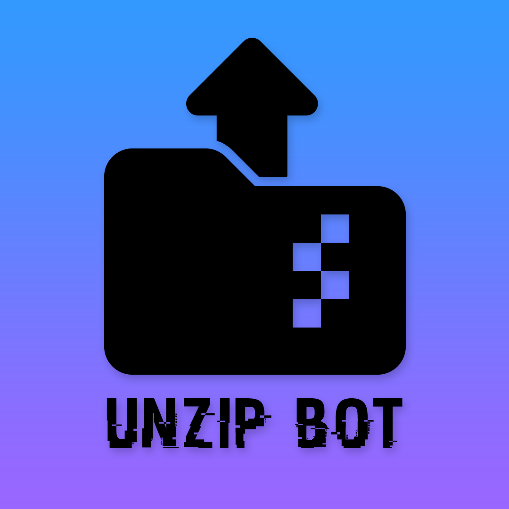

<div align="center">

# unzip-bot
## A Telegram bot to extract various types of archives



[](https://github.com/astral-sh/ruff) [](https://github.com/astral-sh/ruff) [](https://app.deepsource.com/gh/EDM115/unzip-bot/?ref=repository-badge)

[](https://github.com/EDM115/unzip-bot/pulse)

</div>

> [!IMPORTANT]  
> The bot is undergoing an important rewrite.  
> Please be patient and wait a few weeks to get the unzip-bot in its full glory !  
> Check [[ROADMAP] The future of unzip-bot (v7) (#296)](https://github.com/EDM115/unzip-bot/issues/296) to know more about the current development.

---

## :smiling_face_with_three_hearts: Working bot
[@unzip_edm115bot](https://t.me/unzip_edm115bot)  
More info : [edm115.dev/unzip](https://edm115.dev/unzip)

## :eyes: Features
### User side
- Extract all formats of archives like `rar`, `zip`, `7z`, `tar.gz`, …
- Supports password protected archives
- Able to process split archives (`.001`, `.partX.rar`, …)
- Download files from links
- Rename and set custom thumbnail for files
- Uploads files as documents or media
- Can report issues directly

### Admin side
- Broadcast messages to all users or specific ones
- Ban/unban users from using your bot
- Get realtime stats of the bot usage, along an API
- Ability to set sudo users
- Restart simply the bot and pull updates in one command
- Can eval and exec code directly from Telegram
- Send logs in a custom channel/group + retrieve logs from the bot  
And much more :fire: Dive into the code to find out :hand_over_mouth:

## :book: Config vars
- `APP_ID` - Your APP ID. Get it from [my.telegram.org](https://my.telegram.org)
- `API_HASH` - Your API_HASH. Get it from [my.telegram.org](https://my.telegram.org)
- `BOT_OWNER` - Your Telegram Account ID. Get it from [@MissRose_bot](https://t.me/MissRose_bot) (Start the bot and send `/info` command).
- `BOT_TOKEN` - Bot Token of Your Telegram Bot. Get it from [@BotFather](https://t.me/BotFather)
- `MONGODB_DBNAME` - *(optional)* A custom name for the MongoDB database, useful if you deploy multiple instances of the bot on the same account. Defaults to `unzip-bot`
- `MONGODB_URL` - Your MongoDB Atlas URL ([**tutorial here**](CreateMongoDB.md)). This has no default and must be provided in production.
- `AUTO_MIGRATE_ATLAS_SCHEMA` - *(optional, default off)* Set to `true` only if you want the bot to run the Atlas legacy-to-v7 schema migration during startup. You can also run `python scripts/migrate_atlas_schema.py` manually before upgrading.
- `LOGS_CHANNEL` - Make a private channel and get its ID (search on Google if you don't know how to do). Using a group works as well, just add [`Rose`](https://t.me/MissRose_bot?startgroup=startbot), then send `/id` (In both cases, **make sure to add your bot to the channel/group as an admin !**)

SQLite schema changes are applied from ordered SQL files in `unzipbot/db/migrations`.
Applied migrations are stored in the local `Schema_Migrations` table with checksum and
description metadata, so future DB edits should add a new SQL file instead of changing an
already-applied migration.

## :writing_hand: Commands
Copy-paste those to BotFather when he asks you for them
```text
commands - Get commands list
mode - Upload as Doc 📄 / Media 📺
addthumb - Add custom thumbnail
delthumb - Remove your thumbnail
stats - Know if bot is overused
clean - Cancel ongoing process
help - In case you need 😭
```

## :construction: Deploy
Deploying is easy :smiling_face_with_three_hearts: You can deploy this bot in Heroku or in a VPS :heart:  
**Star :star2: Fork :fork_and_knife: and Deploy :outbox_tray:**

> [!TIP]  
> If you need a cloud server (VPS) to host the bot, try Hetzner Cloud.  
> This is what I personally use for all my bots, my website, APIs and more !  
> Cheap service but awesome quality.  
> Sign up using [this link](https://hetzner.cloud/?ref=yGsG8KCFjO6i) to get 20€ in cloud credits.

#### The lazy way
[](https://www.heroku.com/deploy?template=https://github.com/EDM115/unzip-bot/tree/v7)  
(if you're in a fork, make sure to replace the template URL with your repo's one, also replace the URL in the Dockerfile)

#### The fast way
Run the following command in your terminal
```bash
bash <(curl -sSL https://raw.githubusercontent.com/EDM115/unzip-bot/v7-rework-part-1/setup.sh)
```
*if `curl` isn't available on your system, use `wget` :*
```bash
bash <(wget -qO- https://raw.githubusercontent.com/EDM115/unzip-bot/v7-rework-part-1/setup.sh)
```
**DO NOT** run this script as `sudo`. If Docker complains, follow [Docker's postinstall steps](https://docs.docker.com/engine/install/linux-postinstall/).  
Usage of flags is available with this script to make it a bit faster. More info with `-h|--help`  
```bash
bash <(curl -sSL https://raw.githubusercontent.com/EDM115/unzip-bot/v7-rework-part-1/setup.sh) -- -h
```

#### The easy way
- Install [Docker Desktop](https://www.docker.com/products/docker-desktop/) then restart your computer (if on Windows)
```bash
git clone https://github.com/EDM115/unzip-bot.git && cd unzip-bot
nano .env
docker build -t edm115/unzip-bot .
```
- Open Docker Desktop, go on the Images tab, click on the Run button
- On Optional settings, fill the env variables

#### The nerdy way
```bash
git clone https://github.com/EDM115/unzip-bot.git && cd unzip-bot
nano .env
docker build -t edm115/unzip-bot .
docker run -d -v downloaded-volume-prod:/app/Downloads -v thumbnails-volume-prod:/app/Thumbnails --env-file ./.env --name unzipbot edm115/unzip-bot
```

**DONE :partying_face: enjoy the bot !** Be sure to follow me on [GitHub](https://github.com/EDM115) and Star :star2: this repo to show some support :pleading_face:

## How to build after changes ?
#### Trust GitHub Actions
- Add new Actions secrets to the repo :
  - `DOCKER_USERNAME` : all in lowercase
  - `DOCKER_TOKEN` : one with all rights, here : https://hub.docker.com/settings/security
- Go in Actions tab, 2 workflows are here for ya :
  - `Build Docker Image` : Check if it builds without errors
  - `Publish Docker Image` : Rebuild && publish

#### Do it manually
- Go in the repo's folder
```bash
docker build --no-cache -t edm115/unzip-bot .
docker run -d -v downloaded-volume:/app/Downloads -v thumbnails-volume:/app/Thumbnails --env-file ./.env --network host --name unzip-bot-container edm115/unzip-bot
docker start unzip-bot-container
# if you want to check something
docker exec -it unzip-bot-container sh
docker logs unzip-bot-container
# once you're done
docker stop unzip-bot-container
```
- If you wanna publish :
```bash
docker tag edm115/unzip-bot edm115/unzip-bot:latest
```
*(replace `edm115` with your docker hub username, `unzip-bot` with the repo's name and `latest` whith whatever you want)*
```bash
docker login
docker push edm115/unzip-bot:latest
```
*(same, replace accordingly)*

## Dev commands
- Upgrade/install dependencies : `uv sync --extra dev`
- Lint and fix code : `uv run ruff check --fix`
- Format code : `uv run ruff format`
- Type check : `uv run ty check`

## :bug: Found a bug ?
If you found a bug in this bot please open an [issue](https://github.com/EDM115/unzip-bot/issues) or report it on Telegram : [@EDM115](https://t.me/EDM115)  
Same if you have any feature request :wink:

## :money_with_wings: Donate
I'm a young developer from France. If you want to support me, here's how you can do it :
- Star this repository
- Follow me on [GitHub](https://github.com/EDM115)
- Donate :
  - [PayPal](https://paypal.me/8EDM115)
  - [GitHub Sponsors](https://github.com/sponsors/EDM115)
  - [BuyMeACoffee](https://www.buymeacoffee.com/EDM115)
  - [Donate on Telegram](https://t.me/EDM115bots/698)

## :cop: License
`unzip-bot` is licensed under the [MIT License](https://github.com/EDM115/unzip-bot/blob/master/LICENSE)  
This repository originally began as a fork of [`partiallywritten/Unzipper-Bot`](https://github.com/partiallywritten/Unzipper-Bot) (which was licensed under [GPL-3.0](https://github.com/partiallywritten/Unzipper-Bot/blob/main/LICENSE)), with just some additional features and bug fixes. Since `v8`, the codebase has been substantially rewritten and no source code, architecture, unique structure, nontrivial algorithms as expressed, comments, docs, tests, assets, UI text, build scripts, examples, generated files, or other copyrightable material from the original project is intentionally included in the current version.  
The current project is maintained as an independent implementation under the MIT License. Props to Hirusha Himath (`Itz-fork`/`Nexa`/`partiallywritten`) for the og code :saluting_face:  
If you believe any GPL-licensed material from the original project remains, please open an issue with details so it can be reviewed and removed or properly attributed.
